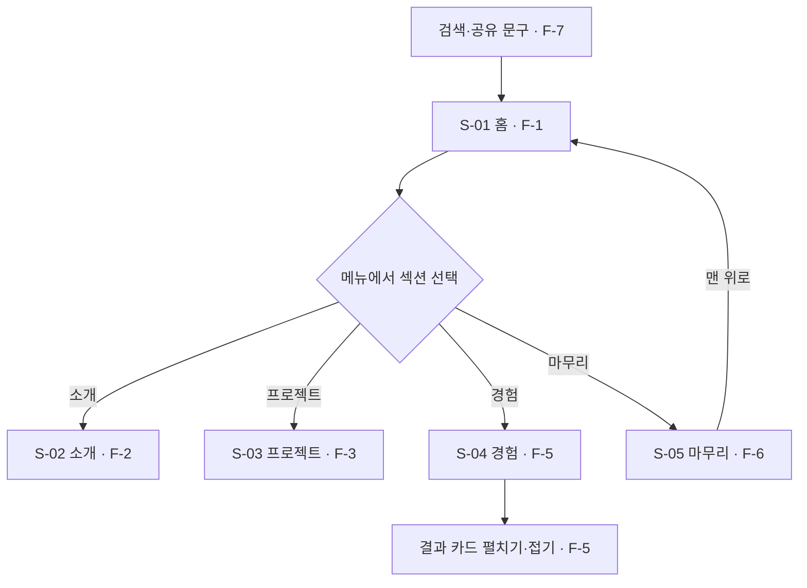
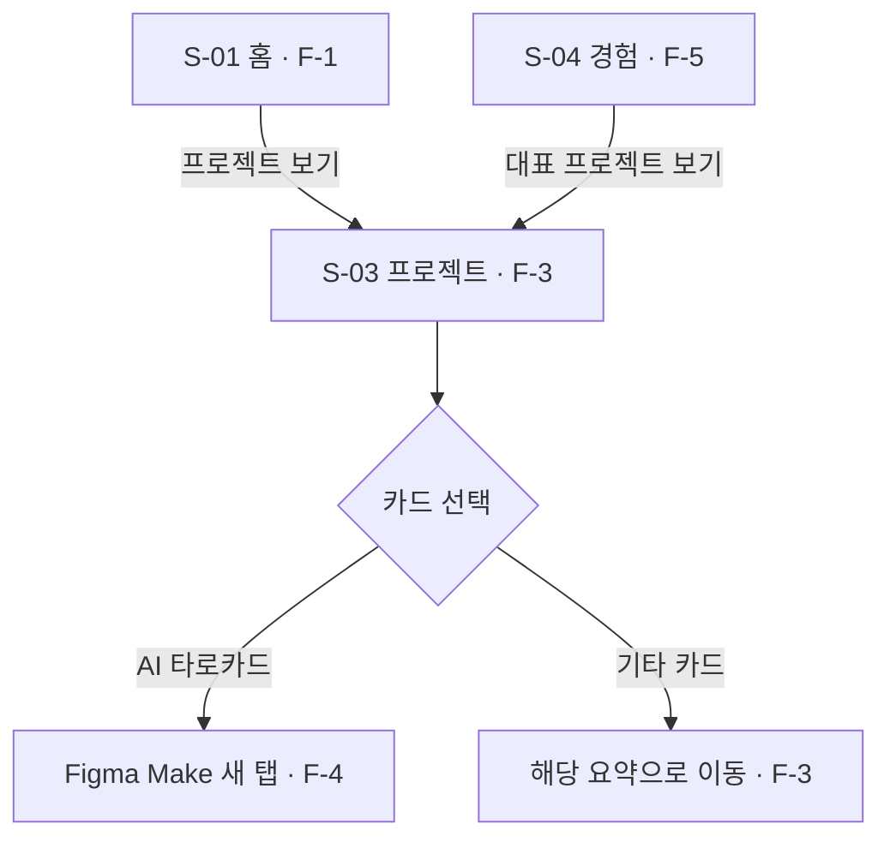

# 유현수 포트폴리오 유저플로우

## 포트폴리오 탐색 (시나리오 1 · 3)

```mermaid
flowchart TD
  A["S-01 홈 · F-1"] --> M{"메뉴에서 섹션 선택"}
  M -->|소개| B["S-02 소개 · F-2"]
  M -->|프로젝트| C["S-03 프로젝트 · F-3"]
  M -->|경험| D["S-04 경험 · F-5"]
  M -->|마무리| E["S-05 마무리 · F-6"]
  D --> R["결과 카드 펼치기·접기 · F-5"]
  E -->|맨 위로| A
  P["검색·공유 문구 · F-7"] --> A
```

## 대표 프로젝트 열기 (시나리오 2)

```mermaid
flowchart TD
  A["S-01 홈 · F-1"] -->|프로젝트 보기| C["S-03 프로젝트 · F-3"]
  C --> D{"카드 선택"}
  D -->|AI 타로카드| F["Figma Make 새 탭 · F-4"]
  D -->|기타 카드| S["해당 요약으로 이동 · F-3"]
  E["S-04 경험 · F-5"] -->|대표 프로젝트 보기| C
```
